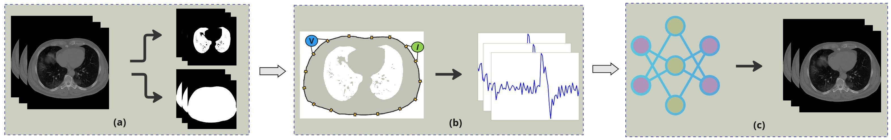

# EIT-to-CT-Cross-Modality-Translation-Using-Diffusion-Transformer

This repo contains code for translating Electrical Impedance Tomography (EIT) voltages into CT-like (sCT) images using a conditional diffusion-transformer. The code is complete, and the repo will be improved and documented further soon.

  

## Getting Started

- `config/` – YAMLs for datasets and models  
- `models/` – code for model components  
- `schedular/` – code for linear noise scheduler used during diffusion  
- `tools/` – code for train and inference
- `dataset/` – dataset class to read data

## Train and Test

- `tools/train_vqvae.py` — **Train the VQ-VAE**
- `tools/infer_vqvae.py` — **Inference/testing the VQ-VAE**
- `tools/train_dit.py` — **Train the Diffusion Model**
- `tools/sample_dit.py` — **Sampling the Diffusion Model**
